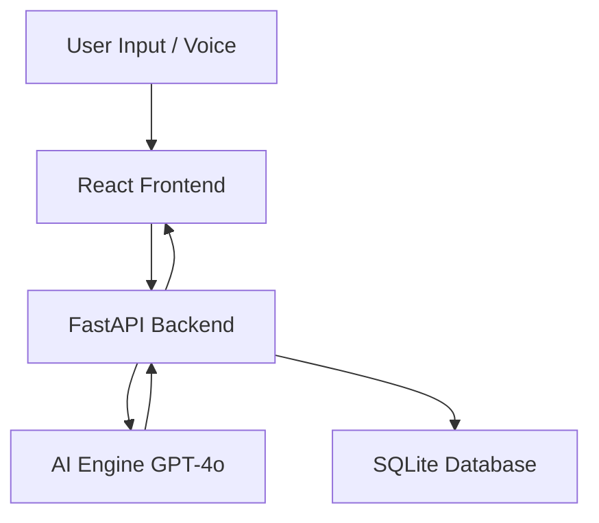

# 🎓 VidyaLoan AI

### 🚀 The 90-Second Education Loan Intelligence Agent


---

## 🌟 Overview

**VidyaLoan AI** is an AI-powered assistant that transforms how students approach education loans.

💡 Instead of confusion, spreadsheets, and delays —
you get **eligibility, ROI insights, EMI planning, and application generation** in a single conversation.

> ⚡ Built to deliver **financial clarity in under 90 seconds**

---

## 🧠 Problem → Solution

### ❌ Problem

* Students don’t know if they qualify for loans
* No clarity on ROI of colleges
* Complex repayment planning
* Tedious loan applications

### ✅ Solution

* AI-driven **Loan Intelligence Agent**
* Real-time eligibility + ROI scoring
* Smart EMI simulations
* Instant application generation

---

## ✨ Features

### 🧮 Smart Eligibility Engine

* AI-based loan approval prediction
* Considers income, academics, and background

### 📊 ROI Intelligence System

* University-level ROI scoring
* Based on placements, fees, salary trends

### 💸 EMI & Repayment Simulator

* Monthly EMI breakdown
* Loan-to-income ratio
* Financial feasibility insights

### 🔁 Rejection Recovery System

* Suggests ways to improve eligibility
* Guides toward approval pathways

### 📝 One-Click Loan Applications

* Auto-generated pre-filled forms
* Reduces friction & errors

### 🎤 Voice-First Interaction

* Powered by Web Speech API
* Fully conversational experience

---

## 🏗️ Tech Architecture



---

## ⚙️ Installation

```bash
# Clone repository
git clone https://github.com/your-username/VidyaLoan-AI.git
cd VidyaLoan-AI
```

### 🔹 Frontend

```bash
cd frontend
npm install
npm run dev
```

### 🔹 Backend

```bash
cd backend
pip install -r requirements.txt
python main.py
```

### 🔹 Environment Variable

```bash
export OPENAI_API_KEY=your_api_key
```

---

## 🧑‍💻 How It Works

1. 🎯 Enter your **dream university & course**
2. 📋 Answer guided financial + academic questions
3. ⚡ AI processes your data instantly
4. 📊 Get your **Loan Intelligence Report**

---

## 📊 Sample Output

* ✅ Eligibility Status
* 📈 ROI Score
* 💰 EMI Plan
* 🔄 Improvement Suggestions
* 📝 Loan Application Form

---

## 🏆 Why This Project Stands Out

* Combines **FinTech + AI + EdTech**
* Solves a **real high-impact problem**
* Built for **speed, clarity, and usability**
* Strong **hackathon + startup potential**

---

## 🔮 Future Enhancements

* 🏦 Bank API integrations
* 🎓 Scholarship matching
* 📉 Credit score analysis
* 🌍 Multi-language support
* 📱 Mobile app version

---

## 🤝 Contributing

```bash
git checkout -b feature/amazing-feature
git commit -m "Add amazing feature"
git push origin feature/amazing-feature
```

---

## 📜 License

MIT License

---

## 👨‍💻 Author

**Pulkit Gambhir**

---

## ⭐ Support

If you like this project:

👉 Give it a **star ⭐ on GitHub**
👉 Share it with others
👉 Use it in your hackathon/demo

---

## 💥 Final Pitch

> VidyaLoan AI turns one of the most stressful financial decisions into a **90-second intelligent conversation**.
